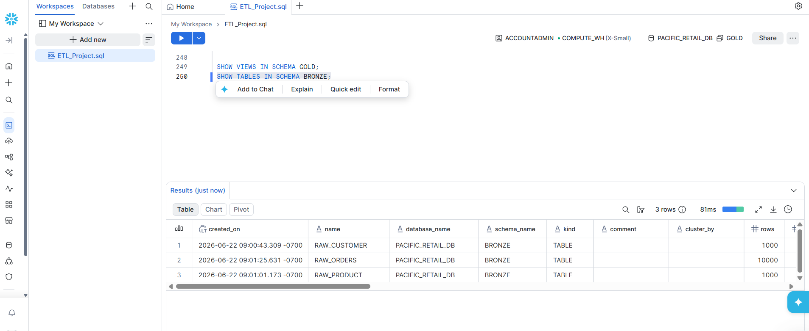
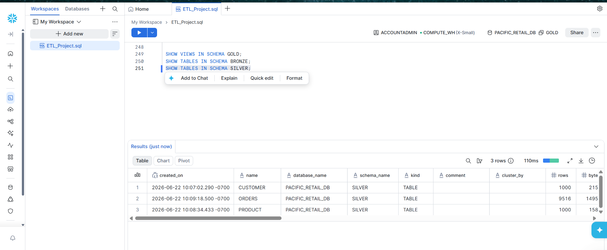
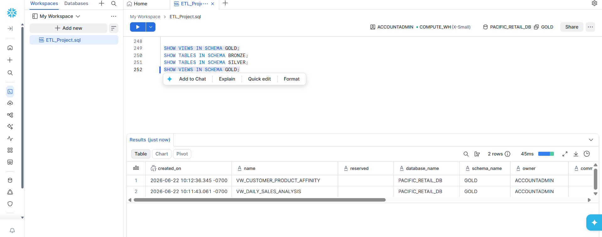
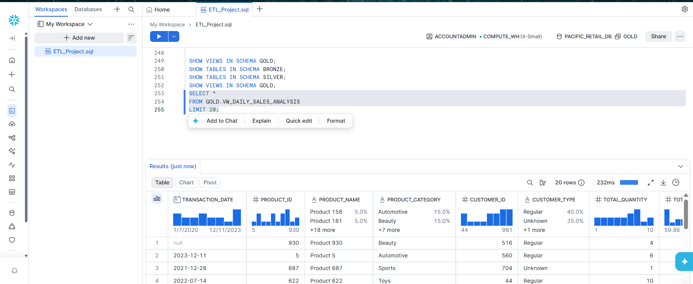

# 🚀 Snowflake Retail ETL Pipeline


## 📌 Project Overview

This project demonstrates the implementation of an end-to-end Data Engineering pipeline using Snowflake and SQL following the Medallion Architecture (Bronze, Silver, and Gold layers).

The pipeline ingests raw retail datasets, performs data quality validations and transformations, and delivers business-ready analytical views for reporting and decision-making.

The project simulates a real-world retail analytics environment where customer, product, and transaction data are processed through multiple layers to ensure reliability, consistency, and analytical usability.

 

# 🏗️ Architecture

```text
                    ┌───────────────────┐
                    │   Source Files    │
                    │   CSV Datasets    │
                    └─────────┬─────────┘
                              │
                              ▼
                 ┌─────────────────────────┐
                 │      BRONZE LAYER       │
                 │      Raw Ingestion      │
                 └─────────┬───────────────┘
                           │
                           ▼
                 ┌─────────────────────────┐
                 │      SILVER LAYER       │
                 │ Data Validation & Clean │
                 └─────────┬───────────────┘
                           │
                           ▼
                 ┌─────────────────────────┐
                 │       GOLD LAYER        │
                 │ Business Analytics View │
                 └─────────────────────────┘
```
# 📸 Snowflake Implementation

## 🥉 Bronze Layer Tables

The Bronze layer stores raw data ingested directly from source CSV files.



---

## 🥈 Silver Layer Tables

The Silver layer applies data cleansing, standardization, and validation rules.



---

## 🥇 Gold Layer Views

The Gold layer contains business-ready analytical views optimized for reporting and decision-making.



---

## 📊 Daily Sales Analysis Output

Sample output from the analytical view created in the Gold layer.



---
 

# 🎯 Business Problem

Retail organizations collect customer, product, and transaction data from multiple systems. Raw data often contains inconsistencies, invalid records, and quality issues that can negatively impact reporting and analytics.

This project demonstrates how Data Engineers design a structured data warehouse that:

- Ingests raw data
- Applies validation rules
- Improves data quality
- Creates analytical datasets
- Supports business intelligence reporting

 

# 📂 Dataset Information

## Customer Dataset

Contains:

- Customer Details
- Demographics
- Registration Information
- Purchase History

### Key Columns

```text
customer_id
name
email
country
customer_type
registration_date
age
gender
total_purchases
```

 

## Product Dataset

Contains:

- Product Information
- Inventory Details
- Product Ratings
- Pricing Data

### Key Columns

```text
product_id
name
category
brand
price
stock_quantity
rating
is_active
```

 

## Orders Dataset

Contains:

- Transaction Details
- Sales Information
- Payment Methods
- Store Channels

### Key Columns

```text
transaction_id
customer_id
product_id
quantity
total_amount
transaction_date
payment_method
store_type
```

 

# 🥉 Bronze Layer

The Bronze Layer stores raw data exactly as received from source systems.

### Tables

| Table Name |
|    |
| RAW_CUSTOMER |
| RAW_PRODUCT |
| RAW_ORDERS |

### Purpose

- Preserve original source data
- Support data lineage
- Enable auditing and troubleshooting

 

# 🥈 Silver Layer

The Silver Layer applies business rules and data quality checks.

## Customer Transformations

### Email Validation

```sql
NULL Email → invalid@example.com
```

### Customer Type Standardization

```sql
regular → Regular
premium → Premium
others → Unknown
```

### Age Validation

```sql
Valid Range : 18 - 120
```

### Gender Standardization

```sql
Male
Female
Other
```

 

## Product Transformations

### Price Validation

```sql
Price > 0
```

### Inventory Validation

```sql
Stock Quantity >= 0
```

### Rating Validation

```sql
Rating between 0 and 5
```

 

## Order Transformations

### Transaction Validation

```sql
Transaction ID cannot be NULL
```

### Revenue Validation

```sql
Total Amount > 0
```

 

# 🥇 Gold Layer

The Gold Layer contains curated business views optimized for reporting and analytics.

 

## 1️⃣ Daily Sales Analysis

### View

```sql
VW_DAILY_SALES_ANALYSIS
```

### Metrics

- Total Quantity Sold
- Total Revenue
- Transaction Count
- Average Price Per Unit
- Average Transaction Value

### Business Value

Provides daily sales performance insights across products and customers.

 

## 2️⃣ Customer Product Affinity

### View

```sql
VW_CUSTOMER_PRODUCT_AFFINITY
```

### Metrics

- Customer Purchase Behavior
- Product Affinity Analysis
- Monthly Spending Trends
- Repeat Purchase Analysis

### Business Value

Helps understand customer preferences and purchasing patterns.

 

# 📊 Data Warehouse Structure

```text
PACIFIC_RETAIL_DB
│
├── BRONZE
│   ├── RAW_CUSTOMER
│   ├── RAW_PRODUCT
│   └── RAW_ORDERS
│
├── SILVER
│   ├── CUSTOMER
│   ├── PRODUCT
│   └── ORDERS
│
└── GOLD
    ├── VW_DAILY_SALES_ANALYSIS
    └── VW_CUSTOMER_PRODUCT_AFFINITY
```

 

# 🛠️ Technologies Used

| Technology | Purpose |
|    |   |
| Snowflake | Cloud Data Warehouse |
| SQL | Data Transformation |
| GitHub | Version Control |
| CSV | Source Data |
| ETL | Data Processing |

 

# 📁 Repository Structure

```text
snowflake-retail-etl
│
├── data
│   ├── customer.csv
│   ├── orders.csv
│   └── products.csv
│
├── sql
│   ├── bronze.sql
│   ├── silver.sql
│   └── gold.sql
│
├── images
│
└── README.md
```

 

# 📈 Key Outcomes

✔ Designed and implemented a multi-layer Snowflake Data Warehouse

✔ Built Bronze, Silver, and Gold architecture

✔ Applied data quality validations and transformations

✔ Developed business-ready analytical views

✔ Implemented end-to-end ETL workflow using SQL

 

# 🔮 Future Enhancements

- Snowpipe Integration
- AWS S3 Data Ingestion
- dbt Transformations
- Apache Airflow Orchestration
- CI/CD Deployment Pipeline
- Power BI Dashboard Integration
- Real-Time Streaming Architecture

 

# 👩‍💻 Author

**Smriti Jha**

Data Engineering | Snowflake | SQL | ETL | Cloud Data Warehousing

 

⭐ If you found this project useful, consider giving it a star.
